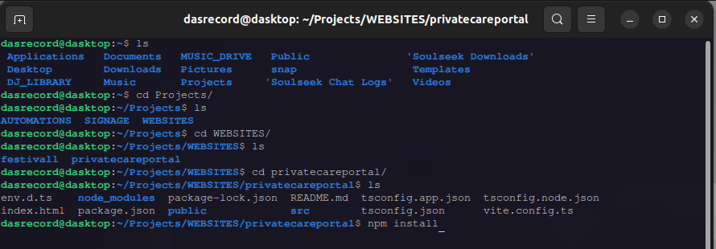
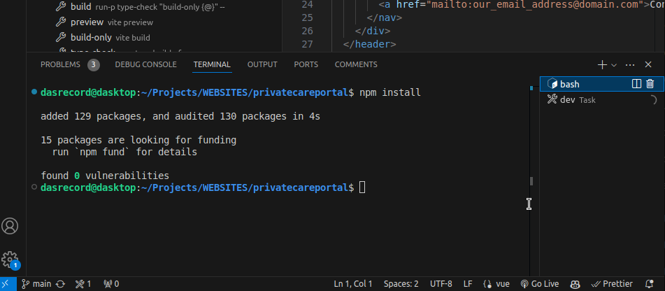

1. 
   Download VS Code
   Congrats! You're officially a developer.

2. 
   Create Github Account
   This is where we'll store and share our updates to our codebase.

3. 
   Download & Install git
   This step ensure your machine understands 'git' which is a version control protocol.
   Think "Track Changes" on steroids.

4. 
   Copy Repository Link
   The repo link for this project is https://github.com/dasrecord/privatecareportal.git

5. 
   Choose Repository Location
   Determine the parent folder where you wish to save this website.
   Do not create a folder called 'privatecareportal' - this will happen automatically later.

6. 
   Clone the Repo
   This creates a local copy of the codebase in your desired location.

7. 
   Open Project in VS Code
   Once cloned you should be able to see the codebase in VSCode

8. 
   Download & Install Node.js
   Node.js is required to run the project.
   Download and install it from the official website found [here](https://nodejs.org/)

9. 
   Run npm install in a terminal
   Open a terminal and navigate to the project directory.
   If this
   Run `npm install` to install all necessary dependencies.

10. 
    Use VS Code's integrated terminal
    You can also use the integrated terminal in VS Code to run `npm install`.

11. 
    Run npm dev
    After installing dependencies, run `npm dev` to start the development server.
    Look for VSCode's hot button as you will be doing this

12. 
    Navigate to localhost
    Open your web browser and navigate to `http://localhost:5173` to see the running application.
